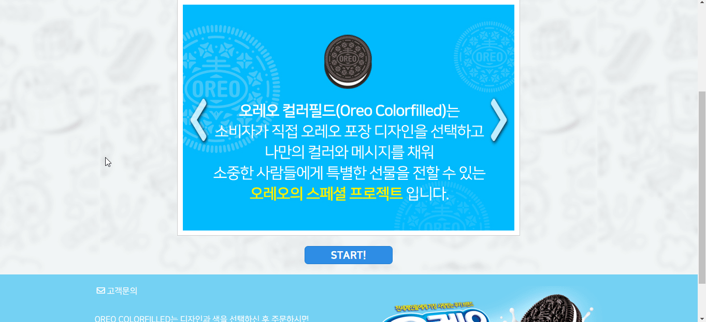

## 대다수의 대화 상자 구현 방식

1. 버튼을 누른다
2. 팝업이 열린다.
3. 닫기 버튼을 누른다.
4. 팝업이 닫힌다.



## 문제점

시각적으로 모든 동작이 명확하고 마우스 또는 터치 사용자가 대화 상자와 완벽하게 상호 작용할 수 있지만 키보드 사용자 및
보조 기술 사용자는 큰 장벽에 직면 할 수 있습니다.

- 대화 상자 열린다는 정보 인지 불가

  > 7.2 예측 가능성

  > 7.2.1. (사용자 요구에 따른 실행) 사용자가 의도하지 않은 기능(새 창, 초점에 의한 맥락 변화 등)은 실행되지 않아야
  > 한다.

  > 컨트롤이나 사용자 입력은 초점을 받았을 때에 의도하지 않는 기능이 자동적으로 실행 되지 않도록 콘텐츠를 개발해야
  > 한다. 즉, 컨트롤이나 사용자 입력의 기능은 사용자의 마우스 클릭이나 키보드 조작에 의하여 실행되어야 한다. **특히
  > 사용자가 인지하지 못한 상황에서 새 창, 팝업 창 등이 열리지 않아야 한다.**

  > **[- 한국형 웹 콘텐츠 접근성 지침 2.1](https://www.wah.or.kr:444/Participation/%ED%95%9C%EA%B5%AD%ED%98%95%EC%9B%B9%EC%BD%98%ED%85%90%EC%B8%A0%EC%A0%91%EA%B7%BC%EC%84%B1%EC%A7%80%EC%B9%A82.1.pdf)**

- 마크업 위치에 따라 문서 탐색 시 링크(버튼)에 이어서 해당 대화 상자로 이동 되지 않음

  > 7.3. 콘텐츠의 논리성

  > 7.3.1. (콘텐츠의 선형 구조) 콘텐츠는 논리적인 순서로 제공해야 한다.

  > 콘텐츠는 보조 기술 사용자가 맥락을 이해할 수 있도록 논리적인 순서로 제공해야 한다.

  > **[- 한국형 웹 콘텐츠 접근성 지침 2.1](https://www.wah.or.kr:444/Participation/%ED%95%9C%EA%B5%AD%ED%98%95%EC%9B%B9%EC%BD%98%ED%85%90%EC%B8%A0%EC%A0%91%EA%B7%BC%EC%84%B1%EC%A7%80%EC%B9%A82.1.pdf)**

- 대화 상자를 벗어나 배경 페이지로 초점 이동

  > 6.1. 입력장치 접근성

  > 6.1.2. (초점 이동) 키보드에 의한 초점은 논리적으로 이동해야 하며, 시각적으로 구별할 수 있어야 한다.

  > 웹 페이지에서 제공하는 모든 기능을 키보드만으로 사용하는 경우에도 사용자 입력 간 의 초점 이동은 적절한 순서를
  > 따라야 하며, 이 과정에서 콘텐츠는 조작이 불가능한 상태가 되거나 갑작스러운 페이지의 전환 등이 일어나지 않아야 한다.

  > **[- 한국형 웹 콘텐츠 접근성 지침 2.1](https://www.wah.or.kr:444/Participation/%ED%95%9C%EA%B5%AD%ED%98%95%EC%9B%B9%EC%BD%98%ED%85%90%EC%B8%A0%EC%A0%91%EA%B7%BC%EC%84%B1%EC%A7%80%EC%B9%A82.1.pdf)**

- 대화 상자를 벗어나 배경 페이지로 이어지는 스크린리더 문서 탐색

  > 상동(上同)

## 과거의 접근성 해결 방법

- 링크(버튼)에 title 속성(attribute)을 이용하여 추가 정보 제공

    ```
    <a href="#voc-dialog" title="레이어 팝업">고객문의</a>
    ```

- 초점이 대화 상자 내부로 이동 된 후 초점 이동을 대화 상자 내부를 순환하도록 가두기

- 가급적 대화 상자의 마크업을 링크(버튼) 바로 이후로 위치

## 여전히 해결되지 않는 문제

- title 속성(attribute) 값은 스크린리더 설정에 따라 읽지 않을 수 있음
- 대화 상자를 벗어나 배경 페이지로 이어지는 스크린리더 문서 탐색
- 대화 상자의 마크업을 링크(버튼) 바로 이후로 위치시키기 어려운 상황 발생

<video width="100%" controls preload="metadata">
  <source src="../video/nvda-test.webm" type="video/mp4">
  <track label="Korean" kind="subtitles" srclang="ko" src="../video/nvda-test.vtt" default>
</video>
